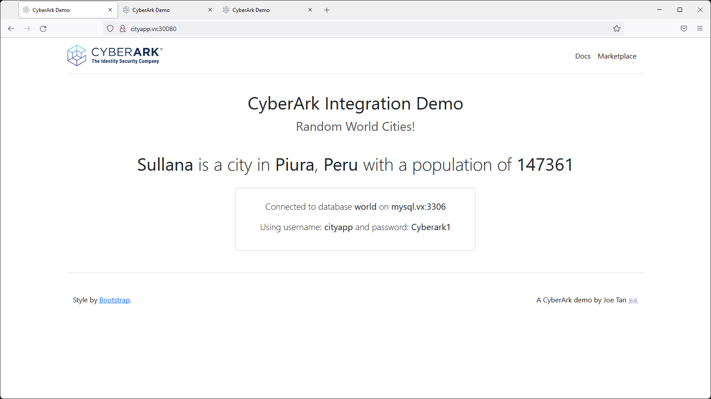
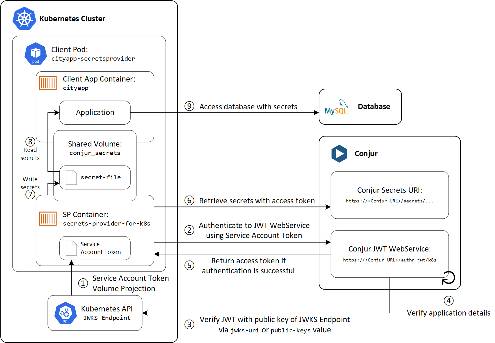
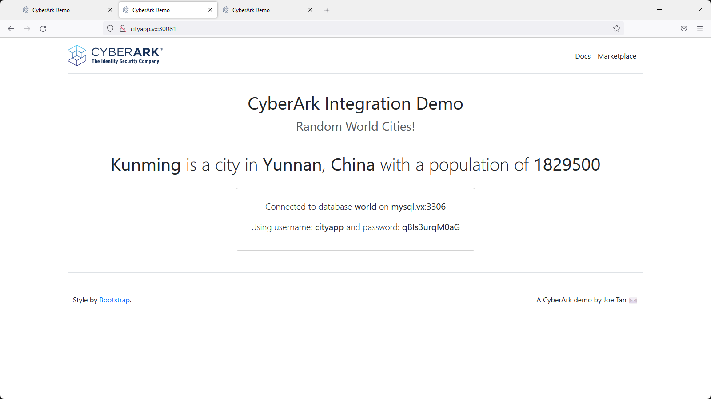
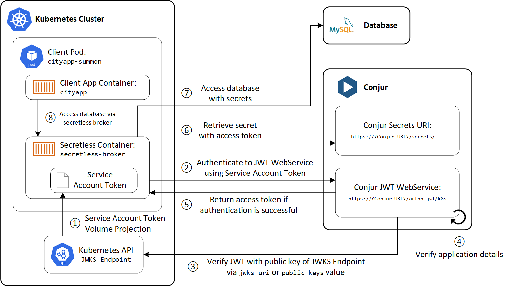
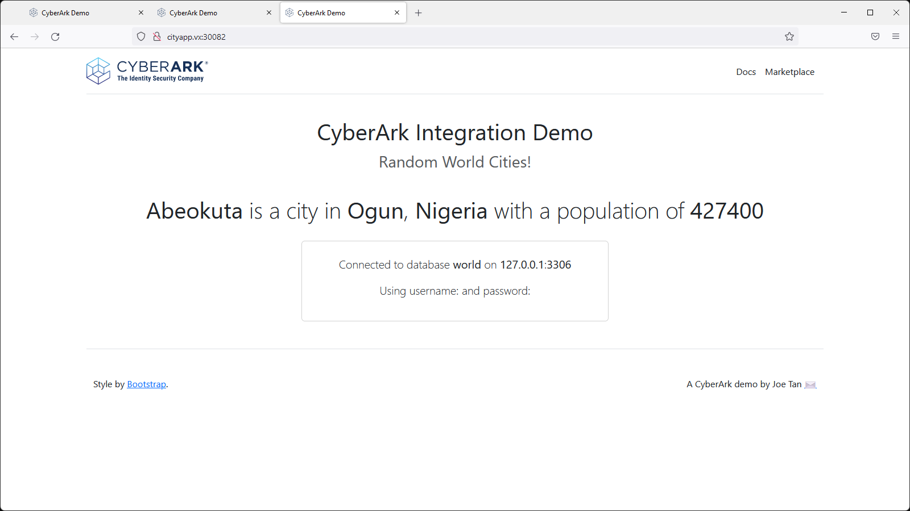

# Integrate Kubernetes with Conjur Enterprise using the JWT authenticator

Overview:
- Construct the JWT authenticator for Kubernetes
- Deploy Conjur follower in Kubernetes
- Deploy demonstration application `cityapp` in different modes: hard-code, secrets provider and secretless

### Software Versions

- RHEL 9.1
- Conjur Enterprise 12.9.0
- Kubernetes 1.26

### Servers

| Hostname  | Role |
| --- | --- |
| conjur.vx  | Conjur master  |
| mysql.vx  | MySQL server  |
| kube.vx  | Single-node Kubernetes cluster  |

# 0. Kubernetes cluster

- This demo should work with any flavour of Kubernetes clusters (On-prem, AKS, EKS), but was tested with a single-node on-prem Kubernetes cluster in my lab
- For a guide to setup a single-node on-prem Kubernetes cluster: <https://github.com/joetanx/cri-o-kube>

# 1. Setup MySQL database

- Setup MySQL database according to this guide: <https://github.com/joetanx/setup/blob/main/mysql.md>

# 2. Setup Conjur master

- Setup Conjur master according to this guide: <https://github.com/joetanx/setup/blob/main/conjur.md>

# 3. Preparing necessary configurations for the JWT authenticator

## 3.1. Configure and enable JWT authenticator

- The policy `authn-jwt-k8s.yaml` performs the following:
  - Define the JWT authenticator endpoint in Conjur
    - Ref: [2. Define the JWT Authenticator endpoint in Conjur](https://docs.cyberark.com/Product-Doc/OnlineHelp/AAM-DAP/Latest/en/Content/Integrations/k8s-ocp/k8s-jwt-authn.htm#ConfiguretheJWTAuthenticator)
    - Creates `conjur/authn-jwt/k8s` policy with the necessary variables
    - Creates the `webservice` for the authenticator with `consumers` group allowed to authenticate to the webservice
  - Enable the seed generation service
    - Ref: [6. Enable the seed generation service](https://docs.cyberark.com/Product-Doc/OnlineHelp/AAM-DAP/Latest/en/Content/Integrations/k8s-ocp/k8s-jwt-authn.htm#ConfiguretheJWTAuthenticator)
    - Creates `conjur/seed-generation` policy
    - Creates the `webservice` for the seed generation with `consumers` group allowed to authenticate to the webservice
  - Define `jwt-apps/k8s` policy with:
    - Conjur Follower in Kubernetes identified by `system:serviceaccount:conjur:follower`
      - Ref: [2. Define an identity in Conjur for the Conjur Follower](https://docs.cyberark.com/Product-Doc/OnlineHelp/AAM-DAP/Latest/en/Content/Integrations/k8s-ocp/k8s-jwt-follower.htm)
      - The Conjur Follower is granted access to the JWT authenticator `conjur/authn-jwt/k8s` and seed generation `conjur/seed-generation` webservices by adding it into `consumers` group of respective webservices
    - Demo application `cityapp-secretsprovider` and `cityapp-secretless` identified by `system:serviceaccount:cityapp:cityapp-secretsprovider` and `system:serviceaccount:cityapp:cityapp-secretless`
      - Ref: [2. Define the application as a Conjur host in policy + 3.Grant access to secrets](https://docs.cyberark.com/Product-Doc/OnlineHelp/AAM-DAP/Latest/en/Content/Integrations/k8s-ocp/cjr-k8s-authn-client-authjwt.htm#Setuptheapplicationtoretrievesecrets)
      - The demo applications are granted access to the JWT authenticator `conjur/authn-jwt/k8s` and demo database secrets `db_cityapp` by adding them to `consumers` group of respective webservice and policy
- ☝️ **Note**: `authn-jwt-k8s.yaml` builds on top of `app-vars.yaml` in <https://github.com/joetanx/conjur-master>. Loading `authn-jwt-k8s.yaml` without having `app-vars.yaml` loaded previously will not work.
- Download and load the Conjur policy

```console
curl -O https://raw.githubusercontent.com/joetanx/conjur-k8s/main/authn-jwt-k8s.yaml
conjur policy load -f authn-jwt-k8s.yaml -b root && rm -f authn-jwt-k8s.yaml
```

## 3.2. Populate the variables required by the JWT Authenticator

- Ref: [3. Populate the policy variables](https://docs.cyberark.com/Product-Doc/OnlineHelp/AAM-DAP/Latest/en/Content/Integrations/k8s-ocp/k8s-jwt-authn.htm#ConfiguretheJWTAuthenticator)

```console
PUBLIC_KEYS="$(kubectl get --raw $(kubectl get --raw /.well-known/openid-configuration | jq -r '.jwks_uri'))"
ISSUER="$(kubectl get --raw /.well-known/openid-configuration | jq -r '.issuer')"
conjur variable set -i conjur/authn-jwt/k8s/public-keys -v "{\"type\":\"jwks\", \"value\":$PUBLIC_KEYS}"
conjur variable set -i conjur/authn-jwt/k8s/issuer -v $ISSUER
conjur variable set -i conjur/authn-jwt/k8s/token-app-property -v sub
conjur variable set -i conjur/authn-jwt/k8s/identity-path -v jwt-apps/k8s
conjur variable set -i conjur/authn-jwt/k8s/audience -v vxlab
```

## 3.3. Allowlist the JWT authenticator in Conjur

- Ref: [4. Allowlist the JWT Authenticator in Conjur](https://docs.cyberark.com/Product-Doc/OnlineHelp/AAM-DAP/Latest/en/Content/Integrations/k8s-ocp/k8s-jwt-authn.htm#ConfiguretheJWTAuthenticator)
- Ref: [Step 1: Allowlist the authenticators](https://docs.cyberark.com/Product-Doc/OnlineHelp/AAM-DAP/Latest/en/Content/Operations/Services/authentication-types.htm#Allowlis)
- ☝️ **Note**: This step requires that the `authenticators` section in `/etc/conjur/config/conjur.yml` to be configured (Ref: 2.5 <https://github.com/joetanx/conjur-master#25-allowlist-the-conjur-default-authenticator>)

```console
podman exec conjur sed -i -e '/authenticators:/a\  - authn-jwt/k8s' /etc/conjur/config/conjur.yml
podman exec conjur evoke configuration apply
```

- Verify that the Kubernetes authenticator is configured and allowlisted

```console
curl -k https://conjur.vx/info
```

## 3.4. Prepare the ConfigMaps

- The Conjur master and follower information is passed to the follower and application pods using ConfigMaps
- Prepare the namespace `conjur` and `cityapp`, and service account `follower`

```console
kubectl apply -f https://raw.githubusercontent.com/joetanx/conjur-k8s/main/k8s-env-prep.yaml
```

- Prepare the necessary values as environments variables to be loaded into ConfigMaps

```console
CA_CERT="$(curl https://raw.githubusercontent.com/joetanx/conjur-k8s/main/central.pem)"
CONJUR_MASTER_URL=https://conjur.vx
CONJUR_FOLLOWER_URL=https://follower.conjur.svc.cluster.local
AUTHENTICATOR_ID=k8s
CONJUR_ACCOUNT=cyberark
CONJUR_SEED_FILE_URL=$CONJUR_MASTER_URL/configuration/$CONJUR_ACCOUNT/seed/follower
CONJUR_AUTHN_URL=$CONJUR_FOLLOWER_URL/authn-jwt/k8s
```

- ☝️ **Note** on `CONJUR_SSL_CERTIFICATE`:
  - `dap-seedfetcher` container needs to verify the Conjur **master** certificate
  - `conjur-authn-k8s-client` and `secretless-broker` containers need to verify the Conjur **follower** certificate
  - Since both the master and follower certificates in this demo are signed by the same CA `central.pem`, using the CA certificate will suffice

- Create ConfigMap `follower-cm` for follower
  - Ref: [3. Set up a ConfigMap](https://docs.cyberark.com/Product-Doc/OnlineHelp/AAM-DAP/Latest/en/Content/Integrations/k8s-ocp/k8s-jwt-follower.htm)

```console
kubectl -n conjur create configmap follower-cm \
--from-literal CONJUR_ACCOUNT=$CONJUR_ACCOUNT \
--from-literal CONJUR_APPLIANCE_URL=$CONJUR_MASTER_URL \
--from-literal CONJUR_SEED_FILE_URL=$CONJUR_SEED_FILE_URL \
--from-literal AUTHENTICATOR_ID=$AUTHENTICATOR_ID \
--from-literal "CONJUR_SSL_CERTIFICATE=${CA_CERT}"
```

- Create ConfigMap `apps-cm` for applications
  - Ref: [Prepare the application namespace, raw Kubernetes manifest](https://docs.cyberark.com/Product-Doc/OnlineHelp/AAM-DAP/Latest/en/Content/Integrations/k8s-ocp/k8s-set-up-apps.htm#Preparetheapplicationnamespace)
  - Ref: [CyberArk raw manifest repository](https://github.com/cyberark/conjur-authn-k8s-client/blob/master/helm/conjur-config-namespace-prep/generated/conjur-config-namespace-prep.yaml)

```console
kubectl -n cityapp create configmap apps-cm \
--from-literal CONJUR_ACCOUNT=$CONJUR_ACCOUNT \
--from-literal CONJUR_APPLIANCE_URL=$CONJUR_FOLLOWER_URL \
--from-literal CONJUR_AUTHN_URL=$CONJUR_AUTHN_URL \
--from-literal "CONJUR_SSL_CERTIFICATE=${CA_CERT}"
```

## 3.5. Optional - Load hosts in CoreDNS
- The `dap-seedfetcher` container uses `wget` to retrieve the seed file from Conjur Master.
- Depending on network configurations, some dual stacked kubernetes may not be able to resolve static host entries in DNS properly, causing `wget: unable to resolve host address` error.
- This is seen in my lab using Sophos Firewall with my Conjur Master FQDN configured as an IPv4 A record. The wget attempts to resolve for both A and AAAA; Sophos Firewall replies to AAAA with an NXDOMAIN response, causing wget to fail.
- This dual-stack behaviour is somewhat explained in: <https://umbrella.cisco.com/blog/dual-stack-search-domains-host-roulette>
- We can ensure resolution of our Conjur Master FQDN by loading it into the Kubernetes CoreDNS. Ref: <https://coredns.io/plugins/hosts/>

```console
kubectl edit cm coredns -n kube-system
```

- Add the hosts portion into the Corefile section

```console
  Corefile: |
    .:53 {
        errors
        health {
           lameduck 5s
        }
        ready
        kubernetes cluster.local in-addr.arpa ip6.arpa {
           pods insecure
           fallthrough in-addr.arpa ip6.arpa
           ttl 30
        }
        prometheus :9153
        forward . /etc/resolv.conf {
           max_concurrent 1000
        }
        cache 30
        loop
        reload
        loadbalance
        hosts {
           192.168.17.90 conjur.vx
           192.168.17.90 mysql.vx
           fallthrough
        }
    }
```

- Restart the CoreDNS deployment

```console
kubectl rollout restart deploy coredns -n kube-system
```

# 4. Deploy the follower

- The `follower.yaml` manifest defines the necessary configurations to deploy the Conjur Follower into Kubernetes; review the file and read the ref link to understand how it works
  - Ref: [4. Set up the Follower service and deployment manifest](https://docs.cyberark.com/Product-Doc/OnlineHelp/AAM-DAP/Latest/en/Content/Integrations/k8s-ocp/k8s-jwt-follower.htm)
- Deploy the manifest file into the Kubernetes cluster

```console
kubectl -n conjur apply -f https://raw.githubusercontent.com/joetanx/conjur-k8s/main/follower.yaml
```

# 5. Preparing for cityapp deployment

- The cityapp application is used to demostrate the various scenarios: hard-coded, secrets-provider, and secretless methods to consume the secrets
- Build cityapp container image

```console
curl -O https://raw.githubusercontent.com/joetanx/cityapp-php/main/Dockerfile
curl -O https://raw.githubusercontent.com/joetanx/cityapp-php/main/index.php
podman build -t cityapp:php .
rm -rf Dockerfile index.php
```

# 6. Deploy cityapp-hardcode

- Verify that the cityapp container image works with a deployment with hard-coded secrets
- Notice that the MySQL credentials are hard-coded in `cityapp-hardcode.yaml`

```console
kubectl -n cityapp apply -f https://raw.githubusercontent.com/joetanx/conjur-k8s/main/cityapp-hardcode.yaml
```

- Verify that the application is deployed successfully

```console
kubectl -n cityapp get pods -o wide
```

- Browse to the Kubernetes node on port 30080 `http://<kube-node-fqdn>:30080` to verify that the application is working
  - The cityapp connects to the MySQL world database to display random city information
  - The database, username and password information is displayed for debugging, and the application is using the credentials hardcoded in the pod environment variables



- Rotate the password on the MySQL server and update the new password in Conjur

| Target | Command |
| --- | --- |
| MySQL Server | `mysql -u root -e "ALTER USER 'cityapp'@'%' IDENTIFIED BY 'qBIs3urqM0aG';"` |
| Conjur | `conjur variable set -i db_cityapp/password -v qBIs3urqM0aG` |

- Refresh the cityapp-hardcode page: the page will throw an authentication error, since the hard-coded credentials are no longer valid

```console
SQLSTATE[HY000] [1045] Access denied for user 'cityapp'@'10.244.0.6' (using password: YES)
```

# 7. Retrieving credentials using Secrets Provider for Kubernetes

- Ref: [Secrets Provider - Push-to-File mode](https://docs.cyberark.com/Product-Doc/OnlineHelp/AAM-DAP/Latest/en/Content/Integrations/k8s-ocp/cjr-k8s-jwt-sp-ic-p2f.htm)



```console
kubectl -n cityapp apply -f https://raw.githubusercontent.com/joetanx/conjur-k8s/main/cityapp-secretsprovider.yaml
```

- Verify that the application is deployed successfully

```console
kubectl -n cityapp get pods -o wide
```

- Browse to the Kubernetes node on port 30081 `http://<kube-node-fqdn>:30081` to verify that the application is working
  - Notice that the database connection details list the credentials retrieved from Conjur



# 8. Deploy cityapp-secretless

## 8.1. Avoiding secrets from ever touching your application - Secretless Broker

- The Secretless Broker enables applications to connect securely to services without ever having to fetch secrets
  - Ref: [Secretless Broker Sidecar](https://docs.cyberark.com/Product-Doc/OnlineHelp/AAM-DAP/Latest/en/Content/Integrations/k8s-ocp/k8s-secretless-sidecar.htm)
- In this demo, `secretless broker` will run as a sidecar container alongside with the `cityapp` container
- The Secretless Broker will
  - Authenticate to Conjur
  - Retreive the secrets
  - Connect to the database
  - Enable a database listener for the application to connect to
- Application connection flow with Secretless Broker:



## 8.2. Prepare the ConfigMap to be used by Secretless Broker

- Secretless Broker needs some configuration to determine where to listen for new connection requests, where to route those connections, and where to get the credentials for each connection.
- Ref: [Prepare the Secretless configuration](https://docs.cyberark.com/Product-Doc/OnlineHelp/AAM-DAP/Latest/en/Content/Integrations/k8s-ocp/k8s-secretless-sidecar.htm#PreparetheSecretlessconfiguration)
- We will map the `cityapp-secretless-cm.yaml` to the `cityapp` container using a ConfigMap
- ☝️ Secretless Broker also need to locate Conjur to authenticate and retrieve credentials, this was done in the previous step where we loaded the `apps-cm` ConfigMap

```console
curl -O https://raw.githubusercontent.com/joetanx/conjur-k8s/main/cityapp-secretless-cm.yaml
kubectl -n cityapp create configmap cityapp-secretless-cm --from-file=cityapp-secretless-cm.yaml && rm -f cityapp-secretless-cm.yaml
```

## 8.3. Deploy the Secretless-based cityapp

```console
kubectl -n cityapp apply -f https://raw.githubusercontent.com/joetanx/conjur-k8s/main/cityapp-secretless.yaml
```

- Verify that the application is deployed successfully

```console
kubectl -n cityapp get pods -o wide
```

- Browse to the Kubernetes node on port 30082 `http://<kube-node-fqdn>:30082` to verify that the application is working
  - Notice that the database connection details list that the application is connecting to `127.0.0.1` using empty credentials


